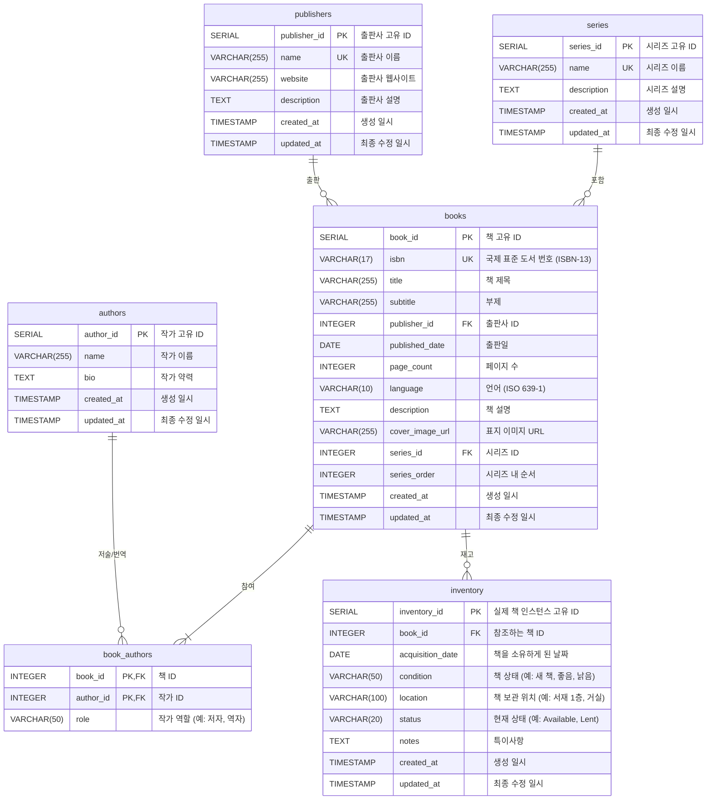

# HAPinUS Book Library

## Description
diagram: EDR

```mermaid
erDiagram
    publishers {
        SERIAL publisher_id PK "출판사 고유 ID"
        VARCHAR(255) name UK "출판사 이름"
        VARCHAR(255) website "출판사 웹사이트"
        TEXT description "출판사 설명"
        TIMESTAMP created_at "생성 일시"
        TIMESTAMP updated_at "최종 수정 일시"
    }

    authors {
        SERIAL author_id PK "작가 고유 ID"
        VARCHAR(255) name "작가 이름"
        TEXT bio "작가 약력"
        TIMESTAMP created_at "생성 일시"
        TIMESTAMP updated_at "최종 수정 일시"
    }

    series {
        SERIAL series_id PK "시리즈 고유 ID"
        VARCHAR(255) name UK "시리즈 이름"
        TEXT description "시리즈 설명"
        TIMESTAMP created_at "생성 일시"
        TIMESTAMP updated_at "최종 수정 일시"
    }

    books {
        SERIAL book_id PK "책 고유 ID"
        VARCHAR(17) isbn UK "국제 표준 도서 번호 (ISBN-13)"
        VARCHAR(255) title "책 제목"
        VARCHAR(255) subtitle "부제"
        INTEGER publisher_id FK "출판사 ID"
        DATE published_date "출판일"
        INTEGER page_count "페이지 수"
        VARCHAR(10) language "언어 (ISO 639-1)"
        TEXT description "책 설명"
        VARCHAR(255) cover_image_url "표지 이미지 URL"
        INTEGER series_id FK "시리즈 ID"
        INTEGER series_order "시리즈 내 순서"
        TIMESTAMP created_at "생성 일시"
        TIMESTAMP updated_at "최종 수정 일시"
    }

    book_authors {
        INTEGER book_id PK,FK "책 ID"
        INTEGER author_id PK,FK "작가 ID"
        VARCHAR(50) role "작가 역할 (예: 저자, 역자)"
    }

    inventory {
        SERIAL inventory_id PK "실제 책 인스턴스 고유 ID"
        INTEGER book_id FK "참조하는 책 ID"
        DATE acquisition_date "책을 소유하게 된 날짜"
        VARCHAR(50) condition "책 상태 (예: 새 책, 좋음, 낡음)"
        VARCHAR(100) location "책 보관 위치 (예: 서재 1층, 거실)"
        VARCHAR(20) status "현재 상태 (예: Available, Lent)"
        TEXT notes "특이사항"
        TIMESTAMP created_at "생성 일시"
        TIMESTAMP updated_at "최종 수정 일시"
    }

    publishers ||--o{ books : "출판"
    series ||--o{ books : "포함"
    books ||--|{ book_authors : "참여"
    authors ||--o{ book_authors : "저술/번역"
    books ||--o{ inventory : "재고"
```