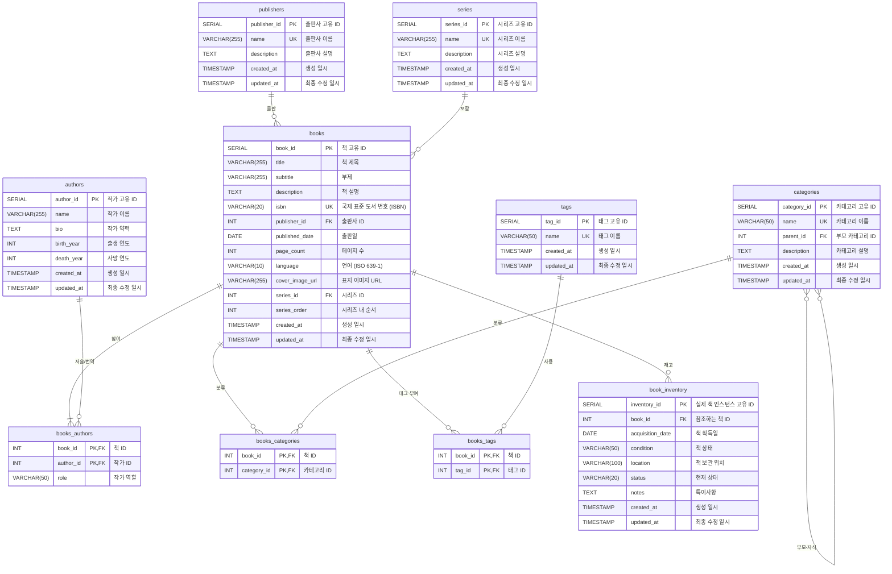

# HAPinUS Book Library

## Introduction
HAPinUS Book Library는 개인 도서관을 관리하기 위한 웹 애플리케이션입니다. 
이 프로젝트는 책의 정보를 효율적으로 관리하고, 대출 및 반납 기능을 제공하며, 책을 검색하고 추천하는 기능을 포함합니다.

## Development Technology Stack
- **Backend**: Django (Web), Django REST Framework (API), Django Channel (WebSocket)
- **Frontend**: Flutter (Mobile/App), Provider (State Management)
- **Database**: PostgreSQL, pgAdmin
- **Version Control**: Git, GitHub
- **ORM**: Django ORM
- **Documentation**: DRF Spectacular (Swagger in Django REST Framework), Dartdoc (Flutter), Markdown
- **Deployment**: Gunicorn(Django WSGI), Nginx, Docker, Azure (App Service, PostgreSQL)
- **Packaging**: pip, pipenv (Python), pub.dev (Dart)
- **Code Formatters and Linters**: Black, isort, Flake8 (Python), dart format, flutter analyze (Dart)
- **IDE**: Visual Studio Code

## Architecture Design
### 진행상황

## API Design
### 진행상황

## Database Design
### 진행상황
- [x] 보관 중인 책을 효율적으로 관리하는 기본 데이터베이스 설계
- [ ] 책에 부수적으로 필요한 정보를 연결하는 테이블 설계 (예: 서평, 추천 등)
- [ ] 책을 대출/반납하는 기능을 위한 테이블 설계
- [ ] 책을 검색하는 기능을 위한 테이블 설계 (예: 검색어, 추천 등)
### diagram: EDR (Entity-Relationship Diagram)
